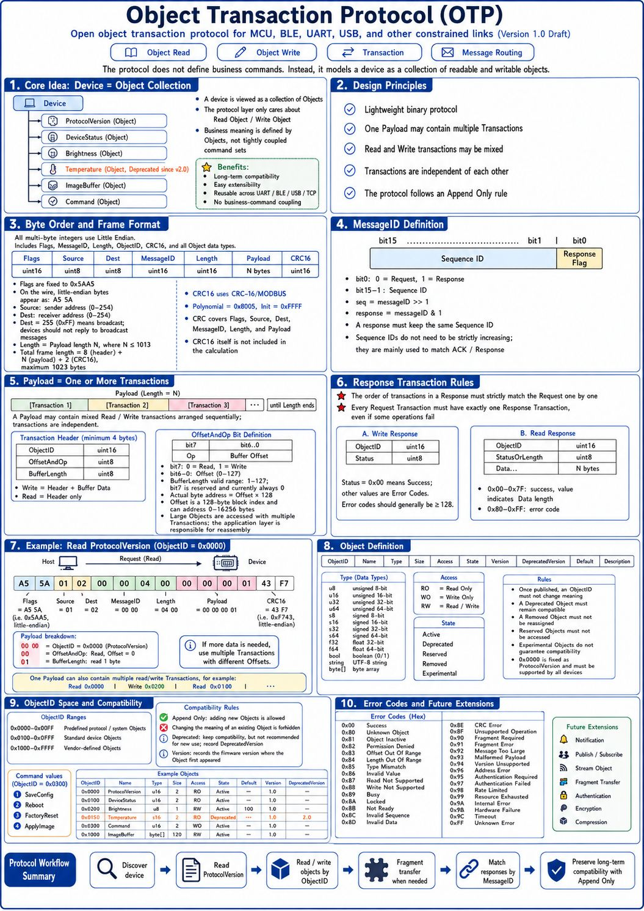

# Object-Transaction-Protocol
An open object transaction protocol designed for MCU, BLE, UART, USB, and other constrained links.

AI-ready by design: stable object model + deterministic transactions.

<p>
	<a href="./Object%20Transaction%20Protocol(zh).md">
		
	</a>
</p>


**Version:** 1.0 Draft

Built for LLM/agent workflows: easier capability discovery, planning, and safe automation across constrained links.



## 1. Introduction

### 1.1 Overview

The Object Transaction Protocol (OTP) is a lightweight binary communication protocol.

The protocol adopts an **Object-Oriented Device Model**.

Instead of defining application-specific commands, the protocol abstracts a device as a collection of readable and writable Objects.

The protocol layer is only responsible for:

- Object Read
- Object Write
- Transaction
- Message Routing

As a result, the protocol provides:

- Long-term compatibility
- Easy extensibility
- Seamless reuse across UART / BLE / USB / TCP
- No coupling to application commands

---

## 2. Design Principles

### 2.1 Device = Object Collection

A device is viewed as a collection of Objects. Higher-level concepts such as ProtocolVersion, DeviceStatus, and Brightness are all instances of Objects.

For example:

```
Device
├── ProtocolVersion (Object)
├── DeviceStatus    (Object)
├── Brightness      (Object)
├── Temperature     (Object, Deprecated since v2.0)
├── ImageBuffer     (Object)
└── Command         (Object)
```

The protocol only cares about:

```
Read Object
Write Object
```

---

### 2.2 Transaction

A single Payload can contain multiple Transactions, which may mix read and write operations.

Transactions are independent of each other.

---

### 2.3 Object Size Constraint

**All Objects must not exceed 127 bytes in size.**

This is a hard constraint in the protocol, for the following reasons:

- The BufferLength field in the Transaction Header has only 7 effective bits (bit7 reserved), with a maximum value of 127
- This ensures efficiency of the protocol on constrained links (MCU, BLE, UART, etc.)

---

## 3. Byte Order

All multi-byte integers in the protocol use:

```
Little Endian
```

Including:

- Flags
- MessageID
- Length
- ObjectID
- CRC16
- All Object data types

---

## 4. Frame Format

```
+---------+--------+------+-----------+--------+---------+-------+
| Flags   | Source | Dest | MessageID | Length | Payload | CRC16 |
+---------+--------+------+-----------+--------+---------+-------+
| uint16  | uint8  |uint8 | uint16    | uint16 | N bytes |uint16 |
+---------+--------+------+-----------+--------+---------+-------+
```

Flags is fixed to `0x5AA5` (two-byte frame header identifier; LE wire bytes: `A5 5A`).

Source is the sender address (`0~254`); Dest is the receiver address (`0~254`). Dest of `255` (0xFF) indicates broadcast. Devices **must not reply** to broadcast messages.

Length (N) has a maximum value of 1013, i.e. N ≤ 1013. Total frame size = 8 (header) + N (Payload) + 2 (CRC16), maximum 1023 bytes.

CRC16 covers Flags, Source, Dest, MessageID, Length, and Payload. CRC16 itself is not included in the calculation. CRC16 uses the CRC-16/MODBUS algorithm (polynomial 0x8005, initial value 0xFFFF).

Example: a request frame reading ProtocolVersion (ObjectID=0x0000):

```
A5 5A 01 02 00 00 04 00 00 00 00 01 43 F7
│─Flags─│S│D│ MessageID│─Length─│───Payload───│──CRC16──│
```

The computed CRC16 is `0xF743`, stored in little-endian as `43 F7`.

Payload breakdown: `00 00` = ObjectID 0x0000 (ProtocolVersion), `00` = OffsetAndOp (Read, Offset=0), `01` = BufferLength (read 1 byte).

---

## 5. Message ID

MessageID is `uint16`.

Definition:

```
bit0:     0 = Request, 1 = Response
bit15~1:  Sequence ID
```

Parsing:

```
seq      = messageID >> 1
response = messageID & 1
```

Responses must preserve the Sequence ID.

> **Note:** Sequence IDs may be assigned arbitrarily and do not need to be strictly sequential. Their primary purpose is to match received ACKs with the corresponding requests.

---

## 6. Payload

Payload contains one or more Transactions, placed sequentially until the end of Length.

---

## 7. Transaction

Transaction Header:

```
ObjectID      uint16
OffsetAndOp   uint8
BufferLength  uint8
```

Minimum 4 bytes.

OffsetAndOp:

```
bit7:     0 = Read, 1 = Write
bit6~0:   Buffer Offset (0~127)
```

BufferLength is a 7-bit effective value (bit7 reserved, always 0 in the current protocol), range `1~127`.

Write includes Header + Buffer Data.
Read includes only the Header.

---

## 8. Response Transaction

The order of Transactions in a Response strictly matches the Request: each Request Transaction has exactly one corresponding Response Transaction. When a Payload containing multiple Transactions is received, the device must return a Response for each Request Transaction in order, regardless of whether individual operations succeed or fail.

### 8.1 Write Response

```
ObjectID      uint16
Status        uint8
```

Status is `uint8`: `0x00` Success, others are Error Codes.

> **Note:** error codes should be >= 128 to remain consistent with read responses.

### 8.2 Read Response

```
ObjectID         uint16
StatusOrLength   uint8
Data...
```

Rules:

```
0x00~0x7F: Success, indicates Data length
0x80~0xFF: Error code
```

---

## 9. Object Definition

Every Object must define the following fields:

| Field             | Description                                  |
|-------------------|----------------------------------------------|
| ObjectID          | Unique identifier                            |
| Name              | Name                                         |
| Type              | Data type (see below)                        |
| Size              | Size in bytes (**not to exceed 127 bytes**)  |
| Access            | Access permission (see below)                |
| State             | State (see below)                            |
| Version           | Firmware version when first introduced       |
| DeprecatedVersion | Firmware version when deprecated (required if State is Deprecated) |
| Default           | Default value (optional)                     |
| Description       | Description                                  |

**Type:**

```
u8, u16, u32, u64, s8, s16, s32, s64, f32, f64, bool, string, byte[]
```

**Size Constraint:**

```
All Objects must not exceed 127 bytes in size.
This is a hard limit due to the BufferLength field in the Transaction Header having only 7 effective bits (bit7 reserved),
limiting the maximum data length per operation to 127 bytes. The total Object size must not exceed this limit.
```

Default field format:

- Integer types (`u8~u64`, `s8~s64`): write the numeric value directly, e.g. `100`, `-5`
- Floating-point types (f32, f64): write as a decimal, e.g. `3.14`
- bool: write `true` or `false`
- string: write a double-quoted string, e.g. `"default_value"`
- byte[]: write a hex string, e.g. `0xA5 0x5A`

**Access:**

| Access | Description                  |
|--------|------------------------------|
| RO     | Read-only (status retrieval) |
| WO     | Write-only (command register)|
| RW     | Read-write                   |

**State:**

| State        | Description                         |
|--------------|-------------------------------------|
| Active       | Active                              |
| Deprecated   | Deprecated, must remain compatible  |
| Reserved     | Reserved, access not permitted      |
| Removed      | Removed, ObjectID must not be reallocated |
| Experimental | Experimental, compatibility not guaranteed |

Rules:

- An ObjectID, once published, must not change semantics.
- Deprecated Objects must remain compatible.
- Removed Objects must not be reallocated.
- Reserved Objects must not be accessed.
- Experimental Objects do not guarantee compatibility.

**ObjectID Address Space Allocation:**

| Range            | Allocation                     |
|------------------|--------------------------------|
| 0x0000~0x00FF    | Protocol-defined system Objects|
| 0x0100~0x0FFF    | Standard device Objects        |
| 0x1000~0xFFFF    | Vendor-defined Objects         |

0x0000 is fixed as ProtocolVersion and must be supported by all devices.

---

## 10. Compatibility Rules

The protocol follows the **Append Only** principle.

Allowed:

```
Add new Objects
```

Prohibited:

```
Modify the semantics of existing Objects
```

Deprecated:

```
Remain compatible, but use is discouraged
Record DeprecatedVersion when marking as deprecated
```

Version:

```
Object records the firmware version at which it was first introduced
```

---

## Appendix A: Error Codes

| Code | Error                  | Description              |
|------|------------------------|--------------------------|
| 0x00 | Success                | Success                  |
| 0x80 | Unknown Object         | Unknown Object           |
| 0x81 | Object Inactive        | Object inactive          |
| 0x82 | Permission Denied      | Permission denied        |
| 0x83 | Offset Out Of Range    | Offset out of range      |
| 0x84 | Length Out Of Range    | Length out of range      |
| 0x85 | Type Mismatch          | Data type mismatch       |
| 0x86 | Invalid Value          | Invalid value            |
| 0x87 | Read Not Supported     | Read not supported       |
| 0x88 | Write Not Supported    | Write not supported      |
| 0x89 | Busy                   | Device busy              |
| 0x8A | Locked                 | Locked                   |
| 0x8B | Not Ready              | Device not ready         |
| 0x8C | Invalid Sequence       | Invalid sequence         |
| 0x8D | Invalid Data           | Invalid data             |
| 0x8E | CRC Error              | CRC check error          |
| 0x8F | Unsupported Operation  | Unsupported operation    |
| 0x92 | Message Too Large      | Message too large        |
| 0x93 | Malformed Payload      | Malformed Payload        |
| 0x94 | Version Unsupported    | Unsupported protocol version |
| 0x95 | Address Error          | Address error            |
| 0x96 | Authentication Required| Authentication required  |
| 0x97 | Authentication Failed  | Authentication failed    |
| 0x98 | Rate Limited           | Rate limited             |
| 0x99 | Resource Exhausted     | Resource exhausted       |
| 0x9A | Internal Error         | Internal error           |
| 0x9B | Hardware Failure       | Hardware failure         |
| 0x9C | Timeout                | Timeout                  |
| 0xFF | Unknown Error          | Unknown error            |

---

## Appendix B: Example Objects

```
Object:       0x0000
Name:         ProtocolVersion
Type:         u16
Size:         2
Access:       RO
State:        Active
Version:      1.0
Description:  OTP protocol version identifier, used for device discovery and compatibility detection
```

```
Object:       0x0100
Name:         DeviceStatus
Type:         u16
Size:         2
Access:       RO
State:        Active
Version:      1.0
Description:  Current device operating status, e.g. standby, running, fault
```

```
Object:       0x0200
Name:         Brightness
Type:         u8
Size:         1
Access:       RW
State:        Active
Default:      100
Version:      1.0
Description:  Display brightness (0~255), supports read and write adjustment
```

```
Object:       0x0150
Name:         Temperature
Type:         s16
Size:         2
Access:       RO
State:        Deprecated
Version:      1.0
DeprecatedVersion: 2.0
Description:  Temperature sensor value (deprecated, superseded by a newer Object)
```

```
Object:       0x0300
Name:         Command
Type:         u16
Size:         2
Access:       WO
State:        Active
Version:      1.0
Description:  Command register; writing a specific value triggers a device operation
```

Command values:

```
1  SaveConfig
2  Reboot
3  FactoryReset
4  ApplyImage
```

```
Object:       0x1000
Name:         ImageBuffer
Type:         byte[]
Size:         120
Access:       RW
State:        Active
Version:      1.0
Description:  Image data buffer, used for firmware upgrades or image transfer
```

---

## Appendix C: Future Extensions

| Extension          | Description                                   |
|--------------------|-----------------------------------------------|
| Notification       | Active notification mechanism for device status push |
| Publish / Subscribe| One-to-many pub/sub model                     |
| Stream Object      | Streamed transfer for audio, video, and other large data |
| Authentication     | Device identity authentication                |
| Encryption         | Transport-layer encryption                    |
| Compression        | Transport data compression                    |


## License

This project is licensed under the Creative Commons Attribution 4.0
International License (CC BY 4.0). See `LICENSE` for details.
